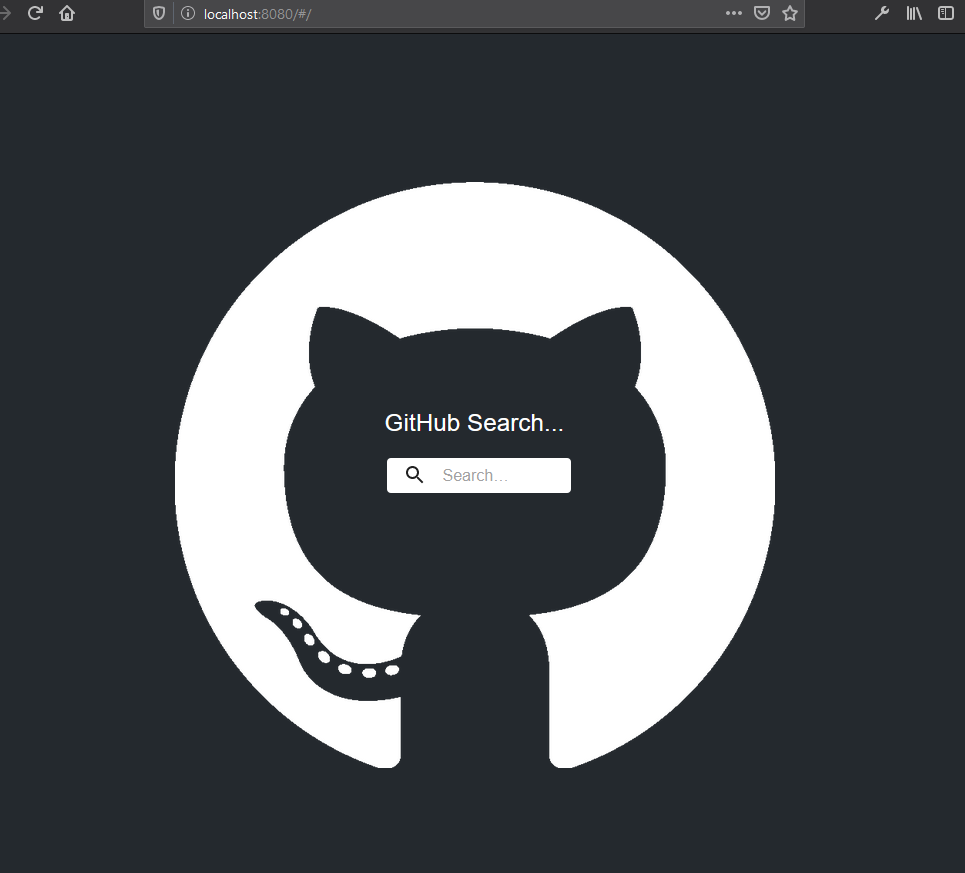
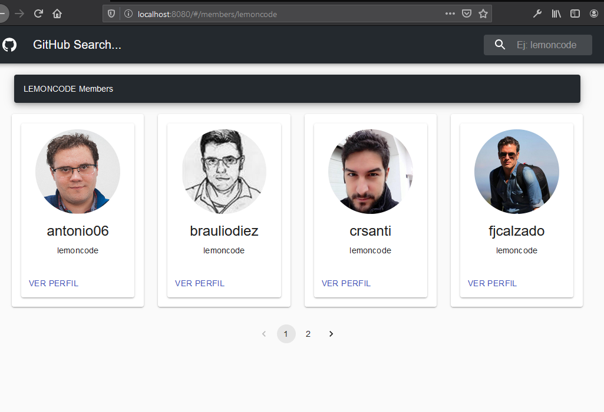
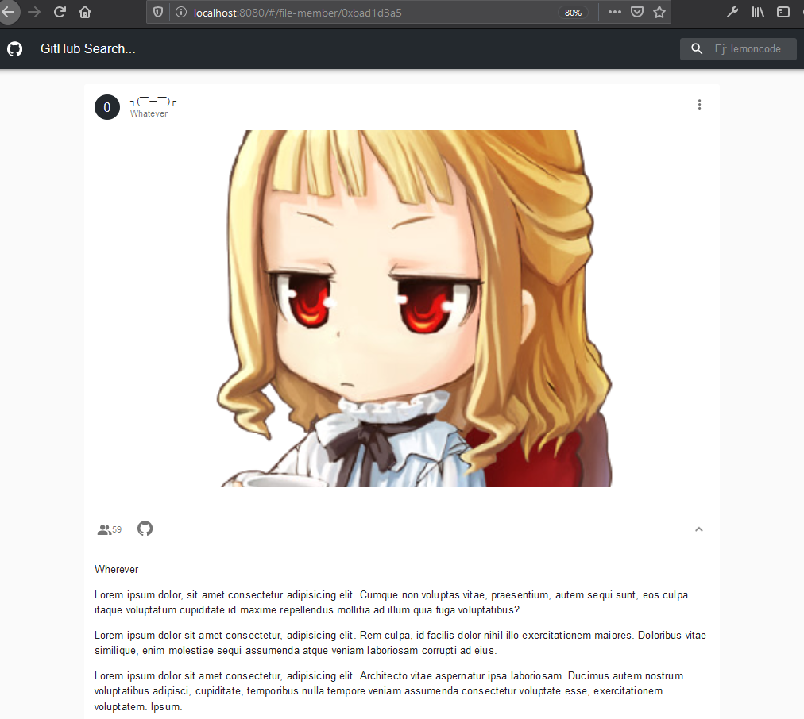

# 5.1 Redux sagas Lab. GitHub Searcher

El ejercicio consiste en extender el ejemplo de mostrar los miembros de una organización que pertenece a Github.

Partimos del [ejercicio de Redux Thunk]("https://github.com/juanpms2/5_Redux-thunk). En este caso se implementará Redux sagas para conectar los datos con los componentes.

Se amplia con lo siguiente:

- Implementar Redux sagas para la carga de integrantes de la organización.
- Navegar a página de detalles de un miembro conectado con Redux sagas.

Aparte de lo requerido se ha añadido la configuración correspondiente de webpack para producción y de rendimiento.

## Capturas de la aplicación

### Index

### Página de miembros de la organización

### Página de perfil individual

